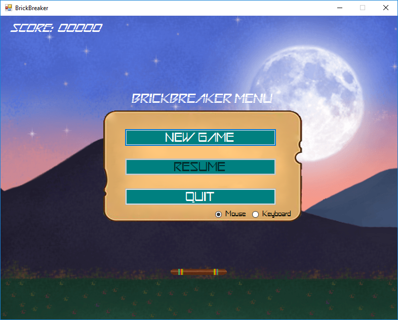
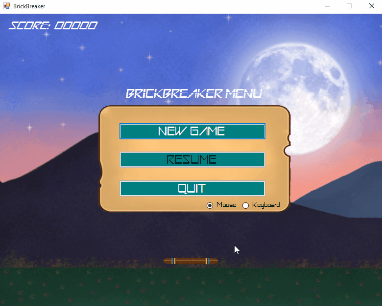

# BrickBreaker-Game
Game created with Windows Forms and C#.

Use the paddle in order to keep the ball in the game & hit the bricks. Your mission is to remove all the bricks by hitting them with the ball.

### Controls
Press "Q" to quit the game.

Press "Esc" if you want to pause the game.

You can choose to control the paddle with the mouse or the keyboard.

When using the mouse, just drag it and the paddle will follow the mouse pointer.

When using the keyboard, use the left and right arrows to move the paddle.

### Screenshots

Here's some gameplay:

